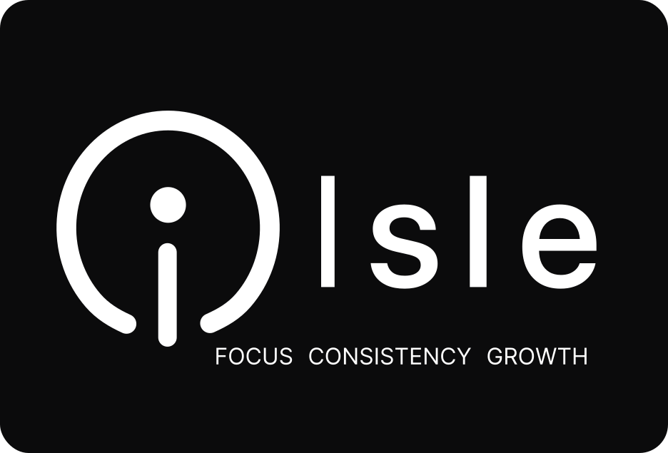
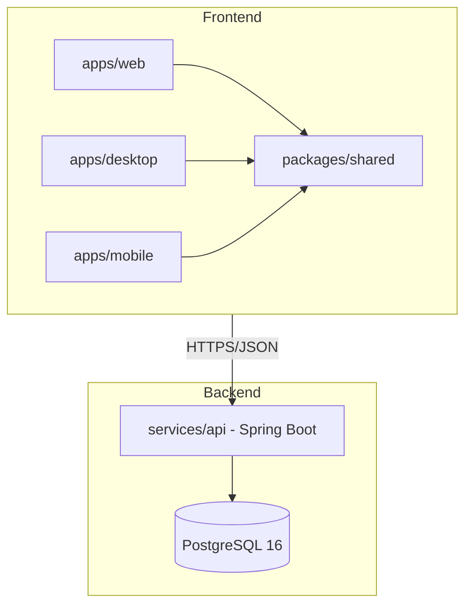

<div align="center">



</div>

# Isle — Advanced Habit Tracker

Isle is a modern, high-performance habit tracking application built for consistency and beautifully crafted analytics. It features a stunning glassmorphic UI, robust recurrence logic, and a strict timezone-aware backend.

Available as a **web application** (Vercel), **native desktop** (Tauri v2), and **mobile** (Tauri v2 + Android).

---

## ✨ Features

- **Rich Habit Types**: Supports Positive (build a habit), Negative (break a bad habit), and Composite (grouped routines, e.g., "Morning Routine" with multiple sub-habits).
- **Flexible Recurrences**: Powered by standard iCal `RRULE` parsing. Schedule habits Daily, Weekly (on specific days), or Monthly.
- **Dynamic Dashboard**: Beautiful UI featuring 30-day contribution grids, streak rings, relative time histories, and animated progress visualizations.
- **Strict Timezone Integrity**: Your streak will never break just because you traveled. The backend enforces `X-Timezone` aware boundary checks for "today" based strictly on the user's local context.
- **Secure Authentication**: Implements a robust Google OAuth 2.0 PKCE flow, safely storing refresh tokens in an encrypted local vault (Tauri Stronghold).

---

## 📦 Monorepo Structure

```
isle/
├── apps/
│   ├── web/              # Web frontend (Vite + React), deployed on Vercel
│   ├── desktop/          # Desktop frontend (Tauri v2 + React), native builds
│   └── mobile/           # Mobile frontend (Tauri v2 + React), Android APK
├── packages/
│   └── shared/           # @isle/shared — shared types, stores, hooks, UI components
├── services/
│   └── api/              # Spring Boot 3.4 REST API
├── infra/                # Docker Compose, Nginx, Vercel config
├── docs/                 # Architecture, flow, and deployment docs
└── scripts/              # Build and release helpers
```

### Workspace Packages

| Package | Location | Description |
|---------|----------|-------------|
| `@isle/web` | `apps/web/` | Web-only variant, Vite + React, Vercel-deployed |
| `@isle/desktop` | `apps/desktop/` | Desktop variant, Tauri v2 + React, native .dmg/.exe/.AppImage |
| `@isle/mobile` | `apps/mobile/` | Mobile variant, Tauri v2 + React, Android APK |
| `@isle/shared` | `packages/shared/` | Shared types, Zustand stores, React hooks, shadcn/ui components |

### Architecture



---

## 📖 Documentation

### Core Architecture & Design
- **[Architecture](./docs/architecture.md)** — System design, components, and infrastructure
- **[System Flow & Architecture](./docs/system-flow-architecture.md)** — End-to-end runtime flows with architecture diagrams
- **[Application Logic](./docs/application-logic.md)** — Recurrence engine, streak calculation, and timezone handling
- **[Database Schema](./docs/database-schema.md)** — Entity relationships and data model
- **[Semantic Versioning & CI/CD](./docs/semantic-release.md)** — Release strategy, branch flow, and automated versioning
- **[CI/CD with Semantic Release](./docs/ci-cd-semantic.md)** — CI gates, CD release flow, and branch cascade behavior

### Module-Specific Guides
- **[Backend Engineering (Spring Boot)](./services/api/README.md)** — API setup, authentication, recurrence engine
- **[Web Frontend (React)](./apps/web/README.md)** — Web-only variant, deployed on Vercel
- **[Desktop Frontend (React + Tauri)](./apps/desktop/README.md)** — Native desktop builds, OAuth flow, Stronghold vault
- **[Shared Package](./packages/shared/README.md)** — Cross-platform code extracted into `@isle/shared`
- **[Infrastructure & Deployment](./infra/README.md)** — Docker, VPS setup, Vercel deployment, CI/CD
- **[Secrets & Security](./infra/secrets/README.md)** — JWT key generation and management

### Project Standards
- **[Contributing](./CONTRIBUTING.md)** — Commit convention and pull request guidelines

### Getting Started
For a quick start guide and project overview, see [Plan.md](./Plan.md).

---

## 📋 License & Security

- **[LICENSE](./LICENSE)** — MIT License
- **[SECURITY](./SECURITY.md)** — Security policy, vulnerability reporting, and best practices
