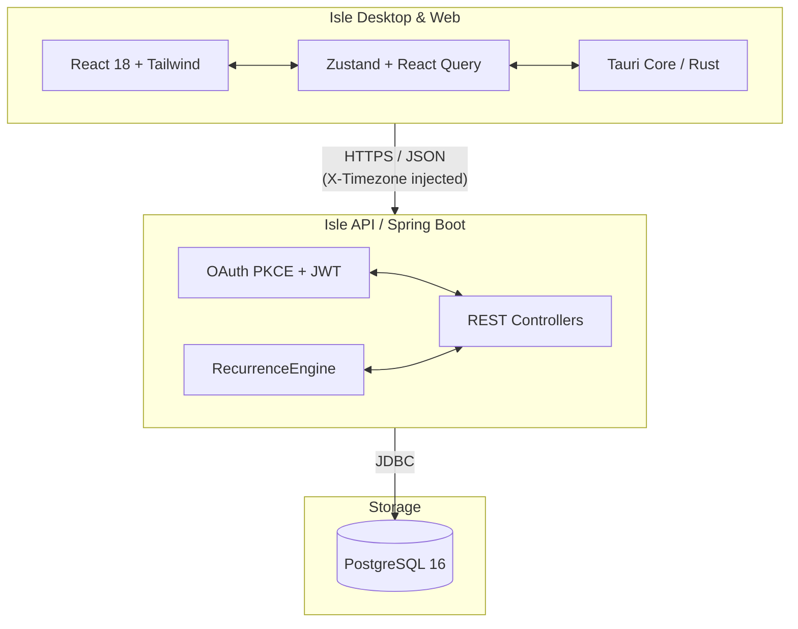
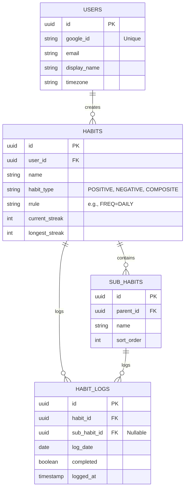

# Isle — Advanced Habit Tracker

Isle is a modern, high-performance habit tracking application built for consistency and beautifully crafted analytics. It features a stunning glassmorphic UI, robust recurrence logic, and a strict timezone-aware backend.

It is available both as a native desktop application (powered by Tauri) and a web application.

---

## ✨ Features

- **Rich Habit Types**: Supports Positive (build a habit), Negative (break a bad habit), and Composite (grouped routines, e.g., "Morning Routine" with multiple sub-habits).
- **Flexible Recurrences**: Powered by standard iCal `RRULE` parsing. Schedule habits Daily, Weekly (on specific days), or Monthly.
- **Dynamic Dashboard**: Beautiful UI featuring 30-day contribution grids, streak rings, relative time histories, and animated progress visualizations.
- **Strict Timezone Integrity**: Your streak will never break just because you traveled. The backend enforces `X-Timezone` aware boundary checks for "today" based strictly on the user's local context.
- **Secure Authentication**: Implements a robust Google OAuth 2.0 PKCE flow, safely storing refresh tokens in an encrypted local vault (Tauri Stronghold).

---

## 🏛 Architecture

Isle is built using a decoupled client-server architecture:

### Application Logic

1. **Recurrence Engine (`RRULE`)**: Instead of relying on crons, the backend uses iCal `RRULE` strings (e.g., `FREQ=WEEKLY;BYDAY=MO,WE,FR`) to calculate whether a habit is "due" on a given client-local date.
2. **Streak Calculation**: Streaks are strictly mathematically derived from the continuous intersection of "due dates" and "logged dates". If a user misses a due date, the `current_streak` falls to 0. 
3. **Timezone Awareness**: The backend *never* relies on UTC system time to judge if a habit was completed "today". All requests from the frontend inject `X-Timezone`, shifting the boundaries of "today" so streaks behave exactly as the user expects, regardless of geography.

---

## 🗄 Database Schema

The persistence layer is managed by PostgreSQL, using strict foreign key constraints and `UUID` primary keys.

---

## 📚 Technical Documentation

For technical guides on how to build, run, and deploy the application, please refer to the specific module READMEs:

- **[Infrastructure & Deployment (Vercel & VPS)](./infra/README.md)**
- **[Frontend Architecture (Tauri + React)](./apps/desktop/README.md)**
- **[Backend Architecture (Spring Boot)](./services/api/README.md)**
