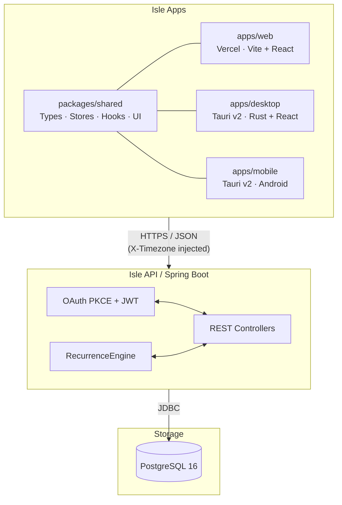
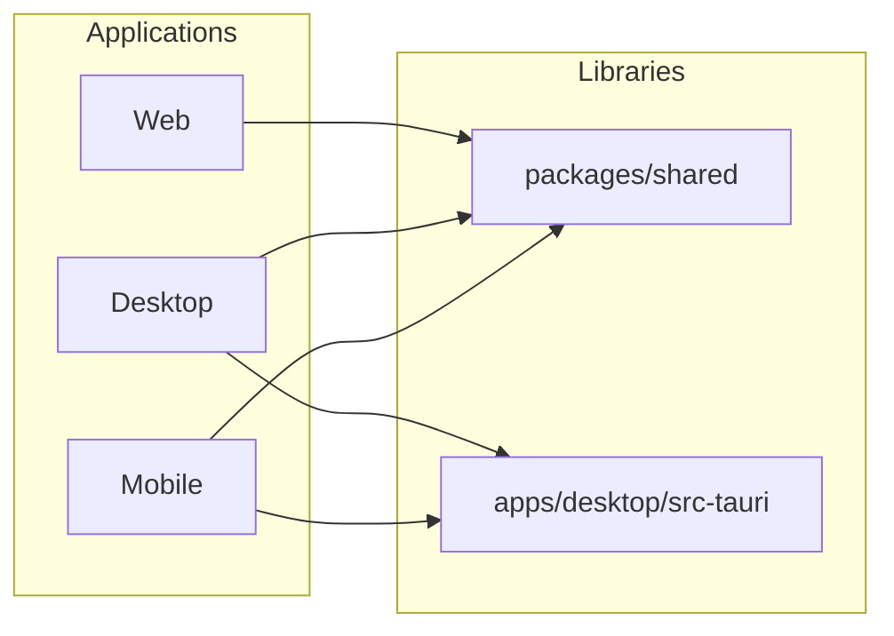

<div align="center">


</div>

# Architecture

Isle is built using a decoupled client-server architecture within a pnpm monorepo:



## Components

- **Frontend**: React 18 with Tailwind CSS, state management via Zustand and React Query. Three variants:
  - **Web** (`apps/web/`) — deployed on Vercel, no native runtime
  - **Desktop** (`apps/desktop/`) — Tauri v2 native app, Rust backend
  - **Mobile** (`apps/mobile/`) — Tauri v2 Android app, shared Rust backend
- **Shared Package** (`packages/shared/`) — `@isle/shared` workspace package with cross-platform types, Zustand stores, React hooks, and shadcn/ui components consumed by all apps
- **Backend**: Spring Boot API with OAuth PKCE authentication and recurrence engine
- **Database**: PostgreSQL 16 with strict foreign key constraints and UUID primary keys

## Workspace Dependency Graph



## Folder Structure

```
isle/
├── apps/
│   ├── web/              # @isle/web — Vercel-deployed React app
│   ├── desktop/          # @isle/desktop — Tauri v2 desktop app
│   └── mobile/           # @isle/mobile — Tauri v2 mobile app
├── packages/
│   └── shared/           # @isle/shared — shared code
├── services/
│   └── api/              # Spring Boot REST API
└── infra/                # Docker, Nginx, deployment configs
```
