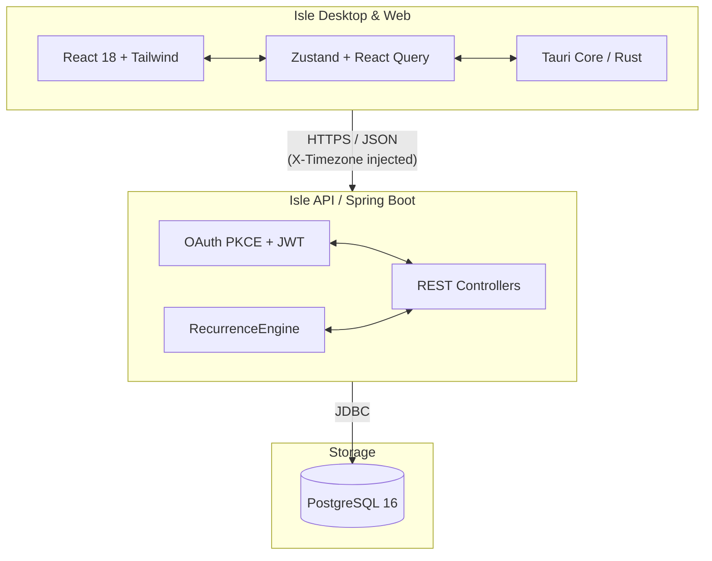

# Architecture

Isle is built using a decoupled client-server architecture:

## Components

- **Frontend**: React 18 with Tailwind CSS, state management via Zustand and React Query. Two variants: **web** (`apps/web/`, deployed on Vercel) and **desktop** (`apps/desktop/`, Tauri v2 native app)
- **Backend**: Spring Boot API with OAuth PKCE authentication and recurrence engine
- **Database**: PostgreSQL 16 with strict foreign key constraints and UUID primary keys
