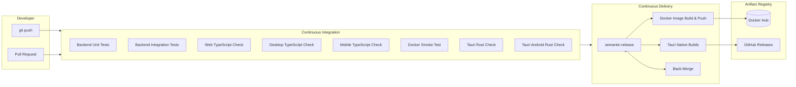
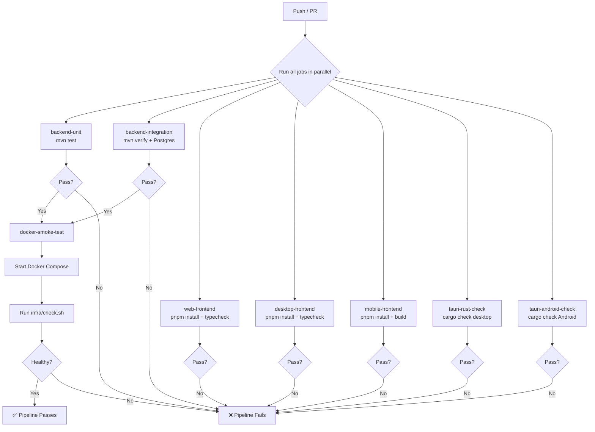
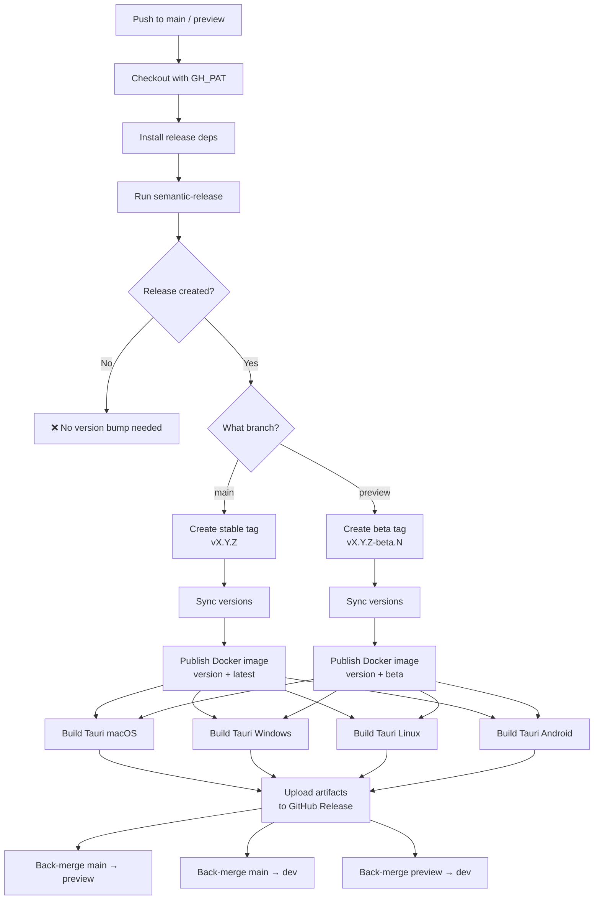
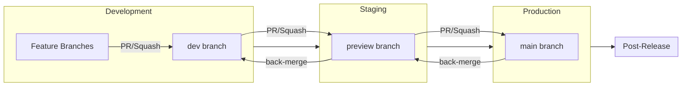
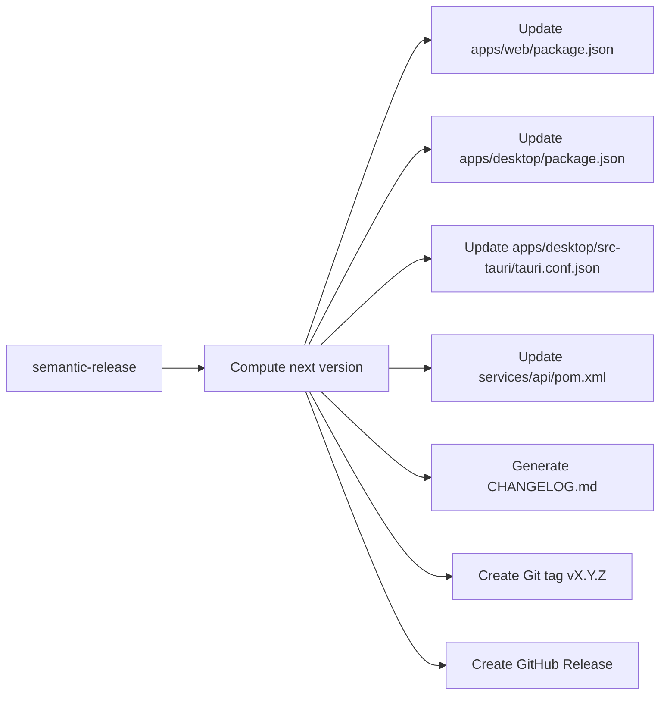
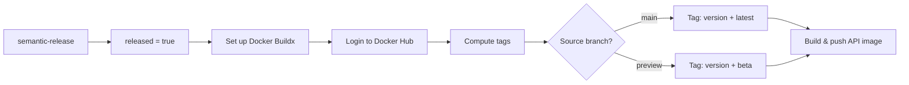
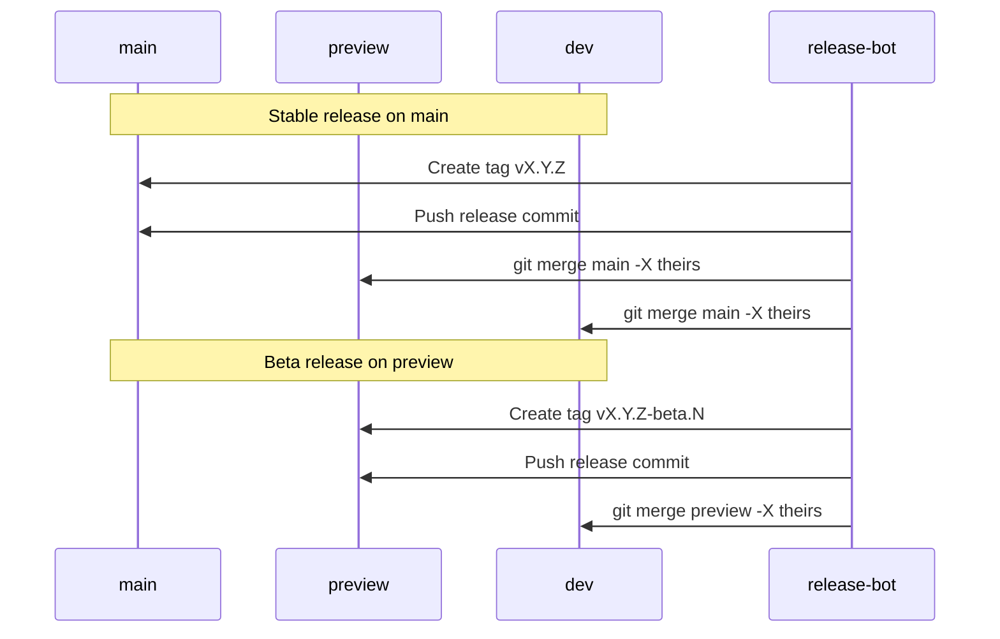

# CI/CD Pipeline

This document describes the complete CI/CD pipeline for the Isle monorepo — from push to production. Two GitHub Actions workflows orchestrate every stage: **CI** (quality gates on every push/PR) and **Release** (automated versioning, publishing, and environment sync).

---

## Pipeline Overview

---

## 1. CI Workflow — Quality Gates

**Trigger:** `push` or `pull_request` on any branch.

**File:** `.github/workflows/ci.yml`

### Jobs

| Job | Runner | Command | Dependencies |
|-----|--------|---------|-------------|
| `backend-unit` | ubuntu-latest | `mvn test` | — |
| `backend-integration` | ubuntu-latest | `mvn verify` + PostgreSQL 16 | — |
| `web-frontend` | ubuntu-latest | `pnpm install && pnpm typecheck` | — |
| `desktop-frontend` | ubuntu-latest | `pnpm install && pnpm typecheck` | — |
| `mobile-frontend` | ubuntu-latest | `pnpm install && pnpm --filter @isle/mobile build` | — |
| `docker-smoke-test` | ubuntu-latest | `docker compose up -d && check.sh` | `backend-unit`, `backend-integration` |
| `tauri-rust-check` | ubuntu-latest | `cargo check` (desktop) | `desktop-frontend` |
| `tauri-android-check` | ubuntu-latest | `cargo check --target aarch64-linux-android` | `desktop-frontend` |

### Docker Smoke Test Detail

The `docker-smoke-test` job is the integration safety net. It:

1. Creates a `.env` file with test credentials
2. Generates temporary JWT RSA key pair
3. Starts the full Docker Compose stack (`docker compose up -d --build`)
4. Runs `infra/check.sh` to verify all services respond correctly
5. Tears down the stack on completion (always, even on failure)

---

## 2. Release Workflow — Automated CD

**Trigger:** `push` to `main` or `preview` branches only.

**File:** `.github/workflows/release.yml`

### Jobs

| Job | Trigger | Dependencies | Purpose |
|-----|---------|-------------|---------|
| `semantic-release` | Always | — | Analyze commits, compute version, update files, create tag |
| `docker-publish` | `released == true` | `semantic-release` | Build and push backend Docker image to Docker Hub |
| `tauri-publish` | `released == true` | `semantic-release` | Build native binaries (macOS/Windows/Linux/Android) and upload to GitHub Release |
| `back-merge` | `released == true` | `semantic-release` | Sync release branch downstream |

---

## 3. Branch Flow & Environment Promotion

### Release Types by Branch

| Branch | Release Type | Docker Tags | Tauri Binaries | Back-merge Target |
|--------|-------------|-------------|----------------|-------------------|
| `main` | Stable (`vX.Y.Z`) | `isle:X.Y.Z`, `isle:latest` | Final release (macOS, Windows, Linux) | `preview` → `dev` |
| `preview` | Beta (`vX.Y.Z-beta.N`) | `isle:X.Y.Z-beta.N`, `isle:beta` | Pre-release (macOS, Windows, Linux, Android) | `dev` |
| `dev` | None | N/A | N/A | N/A |

---

## 4. Version Sync Flow

When a release is created, semantic-release updates version strings across all apps to keep them in sync:

---

## 5. Commit-to-Version Rules

| Commit Prefix | Version Bump | Example |
|--------------|-------------|---------|
| `fix:`, `perf:`, `refactor:` | Patch | `v1.0.0` → `v1.0.1` |
| `feat:` | Minor | `v1.0.0` → `v1.1.0` |
| `feat!:`, `BREAKING CHANGE:` | Major | `v1.0.0` → `v2.0.0` |
| `docs:`, `chore:`, `ci:` | None | N/A |

---

## 6. Docker Image Publishing

### Image Tags

| Branch | Tags Published | Example |
|--------|---------------|---------|
| `main` | `<version>`, `latest` | `<username>/isle:1.4.0`, `<username>/isle:latest` |
| `preview` | `<version>`, `beta` | `<username>/isle:1.4.0-beta.1`, `<username>/isle:beta` |

---

## 7. Tauri Native Build Matrix

The `tauri-publish` job builds and uploads native binaries for every platform:

| OS | Build Target | Artifacts | Rust Target |
|----|-------------|-----------|-------------|
| macOS (macos-latest) | Desktop | `.dmg` | `x86_64-apple-darwin` |
| Windows (windows-latest) | Desktop | `.exe`, `.msi` | `x86_64-pc-windows-msvc` |
| Ubuntu (ubuntu-latest) | Desktop | `.AppImage`, `.deb` | `x86_64-unknown-linux-gnu` |
| Ubuntu (ubuntu-latest) | Android | `.apk`, `.aab` | `aarch64-linux-android` |

---

## 8. Back-Merge Strategy

To prevent post-release drift, each release triggers an automated back-merge to downstream branches:

The `-X theirs` flag auto-resolves conflicts in favor of the higher environment (release source).

---

## 9. Required Secrets

| Secret | Used By | Purpose |
|--------|---------|---------|
| `GH_PAT` | All release jobs | Authenticated checkout/push through branch protection |
| `DOCKERHUB_USERNAME` | `docker-publish` | Docker Hub namespace for image publishing |
| `DOCKERHUB_TOKEN` | `docker-publish` | Docker Hub access token for authenticated pushes |
| `VITE_API_BASE_URL` | `tauri-publish` | Backend API endpoint for Tauri builds |
| `VITE_GOOGLE_CLIENT_ID` | `tauri-publish` | Google OAuth client ID for Tauri builds |
| `VITE_REDIRECT_URI` | `tauri-publish` | OAuth callback URI for Tauri builds |

---

## 10. Workflow Files

| File | Path | Purpose |
|------|------|---------|
| CI | `.github/workflows/ci.yml` | Build, test, type-check on every push/PR |
| Release | `.github/workflows/release.yml` | Version, publish, and back-merge on main/preview |

---

## 11. Failure Modes & Recovery

| Failure | Cause | Recovery |
|---------|-------|----------|
| CI job fails | Test/type/build error | Fix code, push again |
| `docker-smoke-test` fails | Docker Compose or smoke check | Check `infra/check.sh` and Docker config |
| `semantic-release` fails | Commit message format or GH_PAT | Inspect logs, fix commits or credentials |
| `docker-publish` fails | Docker Hub auth or build | Verify `DOCKERHUB_USERNAME` and `DOCKERHUB_TOKEN` |
| `tauri-publish` fails | Missing system deps or Rust errors | Check runner setup and Rust compilation |
| `back-merge` fails | Branch divergence | Manually resolve and push from release branch head |
