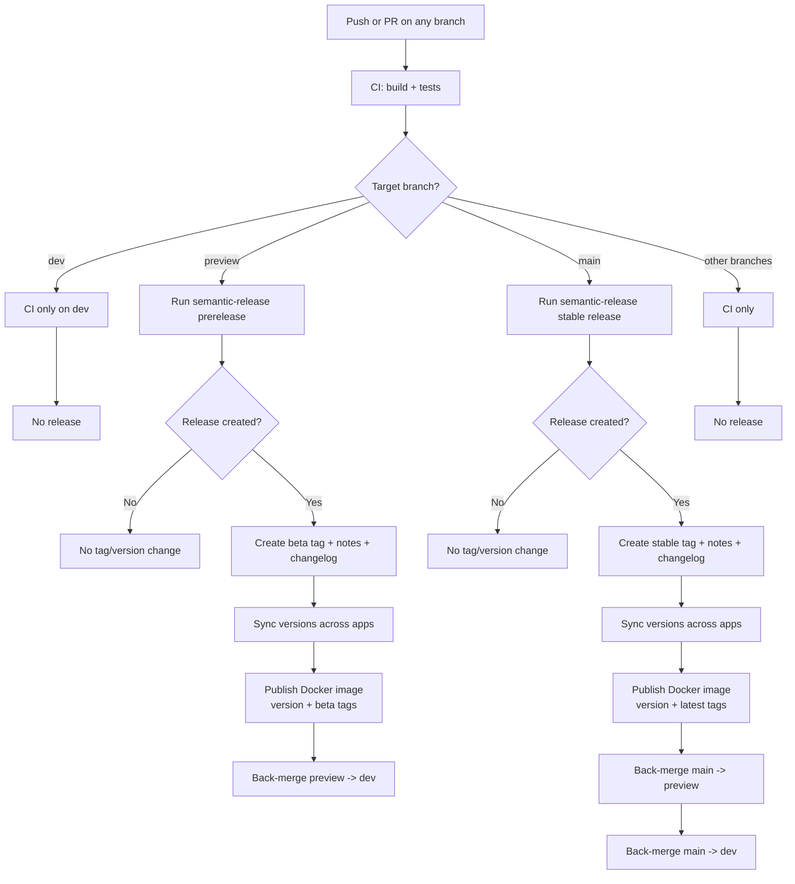
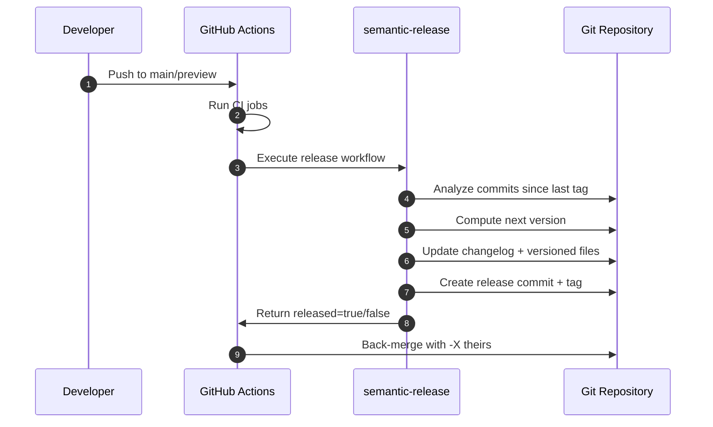

# CI/CD with Semantic Release

This document covers only the CI/CD and automated versioning flow for Isle.

## Scope

- Continuous Integration (CI): build and test validation
- Continuous Delivery/Deployment (CD): semantic versioning, tagging, release notes, and branch back-merges
- Branch policy:
  - `main`: production stable releases
  - `preview`: beta pre-releases
  - `dev`: integration branch (no direct releases)

## 1. Pipeline Overview

## 2. CI Responsibilities

CI runs quality and correctness checks before release logic:

- Backend unit tests
- Backend integration tests
- Frontend build/checks

Goal: block invalid changes before release automation.

## 3. CD Responsibilities (Semantic Release)

CD is triggered by push events on `main` and `preview`.

Semantic Release performs:

1. Analyze commits using Conventional Commits.
2. Calculate next version.
3. Generate changelog and GitHub release notes.
4. Create Git tag in format `vX.Y.Z`.
5. Run version synchronization script:
   - `apps/desktop/package.json`
   - `apps/desktop/src-tauri/tauri.conf.json`
   - `services/api/pom.xml`
6. Commit release artifacts.
7. Publish backend Docker image to Docker Hub.
8. Back-merge source branch into downstream branches.

## 4. Branch Release Matrix

| Branch | Release Type | Example | Docker Tags | Back-merge Target |
| --- | --- | --- | --- | --- |
| `main` | Stable | `v1.4.2` | `isle:1.4.2`, `isle:latest` | `preview`, then `dev` |
| `preview` | Prerelease (`beta`) | `v1.5.0-beta.1` | `isle:1.5.0-beta.1`, `isle:beta` | `dev` |
| `dev` | None | N/A | N/A | N/A |

## 5. Commit-to-Version Rules

| Commit Pattern | Version Impact |
| --- | --- |
| `fix:` `perf:` `refactor:` | Patch |
| `feat:` | Minor |
| `feat!:` or `BREAKING CHANGE:` | Major |
| `docs:` `chore:` `ci:` | No release by default |

## 6. Release Sequence

## 7. Required Secrets

- `GH_PAT`: required for authenticated checkout/push and protected branch operations.
- `DOCKERHUB_USERNAME`: Docker Hub namespace/user for image publishing.
- `DOCKERHUB_TOKEN`: Docker Hub access token for authenticated push.
- `NPM_TOKEN`: not required for publishing because npm publishing is disabled.

## 8. Safety Controls

- Checkout uses `token: secrets.GH_PAT` in every release job.
- Docker publish runs only when a release is actually created.
- Back-merges use `-X theirs` to reduce merge-conflict failures.
- Release workflow proceeds to back-merge only if an actual release was created.

## 9. Failure Modes and Recovery

- If CI fails: fix tests/build first, then re-run.
- If release step fails: inspect workflow logs and semantic-release output.
- If back-merge fails: resolve branch divergence manually, then rerun from latest release branch head.

## 10. Quick Operational Checklist

1. Ensure branches exist: `main`, `preview`, `dev`.
2. Configure `GH_PAT` in repository secrets.
3. Configure `DOCKERHUB_USERNAME` and `DOCKERHUB_TOKEN` in repository secrets.
4. Enforce Conventional Commits in PRs.
5. Merge to `preview` for beta validation and `beta` image publication.
6. Merge to `main` for production release and `latest` image publication.
