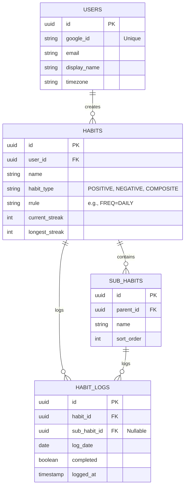

# Database Schema

The persistence layer is managed by PostgreSQL, using strict foreign key constraints and `UUID` primary keys.

## Tables

- **USERS**: User accounts with timezone and OAuth information
- **HABITS**: Habit definitions with recurrence rules and streak tracking
- **SUB_HABITS**: Sub-tasks within composite habits
- **HABIT_LOGS**: Historical logs of habit completions
