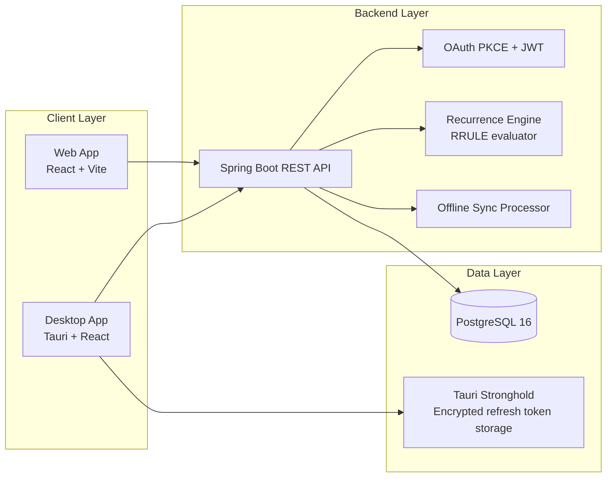
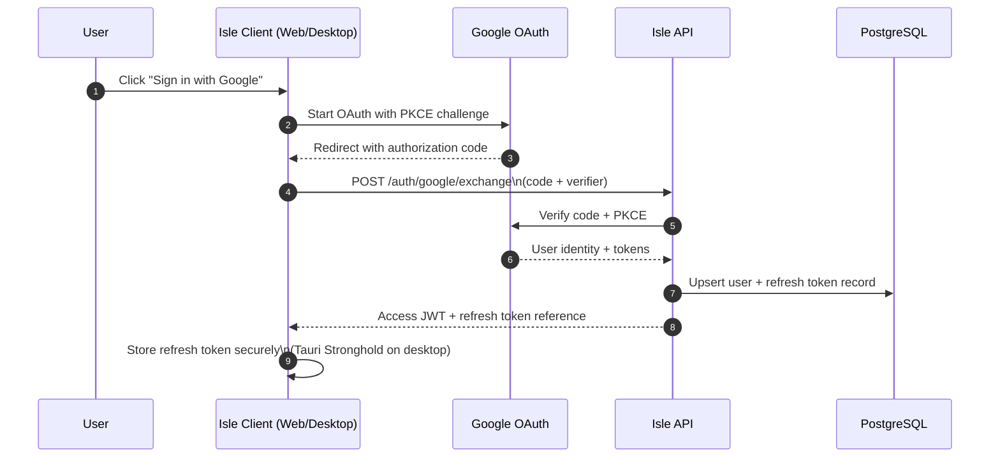
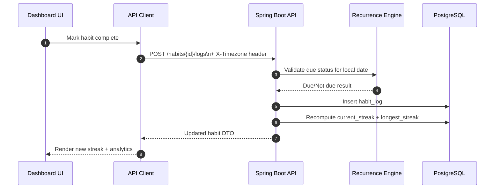
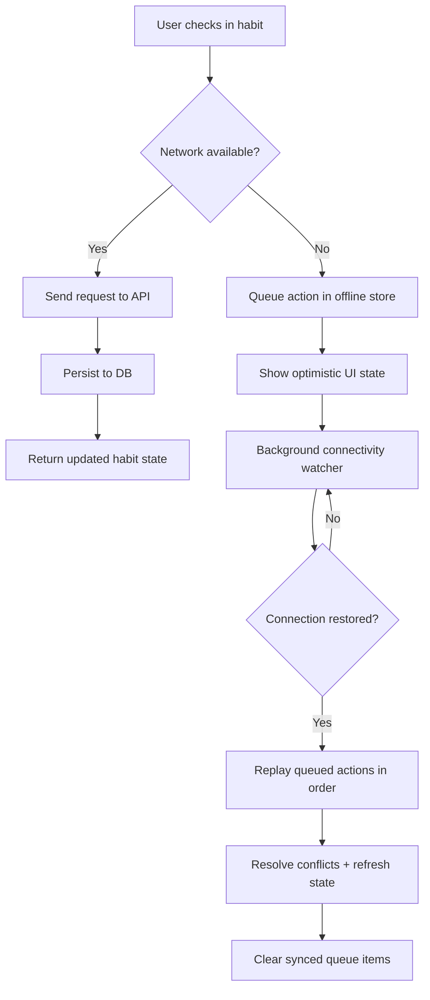
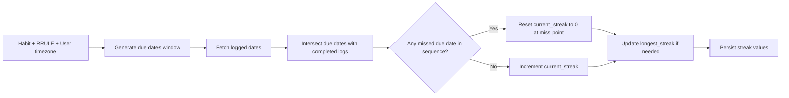
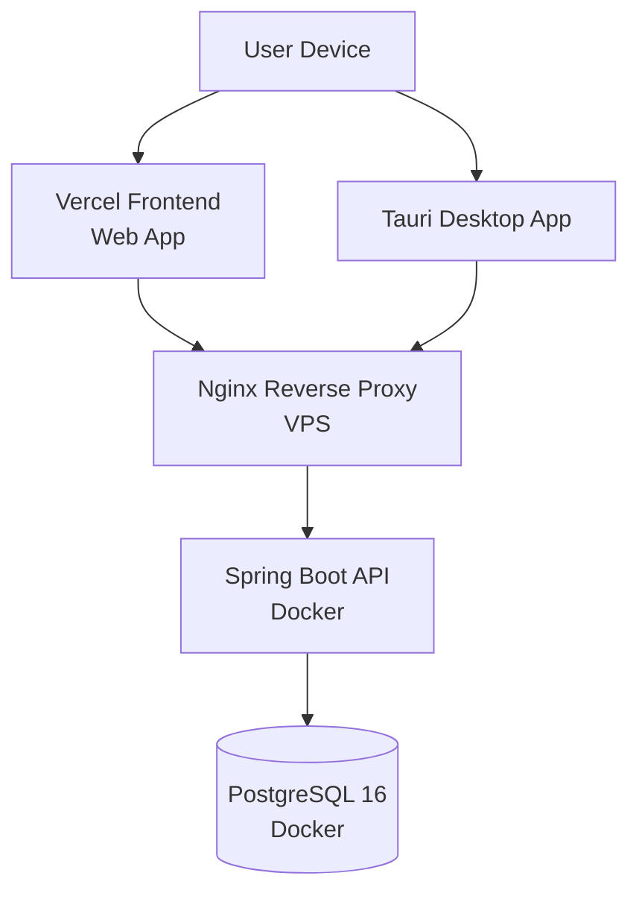

# System Flow & Architecture

This document explains how Isle is structured and how data moves across the system at runtime.

## 1. High-Level Architecture

## 2. Authentication Flow (OAuth PKCE)

## 3. Habit Check-In Flow (Online)

## 4. Offline Sync Flow (Desktop/Web)

## 5. Streak Calculation Logic Flow

## 6. Request Boundaries and Timezone Integrity

- The client injects `X-Timezone` in time-sensitive requests.
- The API computes "today" and due-date boundaries using the client timezone.
- Streak integrity is based on local-date boundaries, not server UTC time.

## 7. Deployment Runtime Topology

## 8. Operational Notes

- Release automation is documented in `docs/semantic-release.md`.
- Backend module details are in `services/api/README.md`.
- Frontend module details are in `apps/desktop/README.md`.
